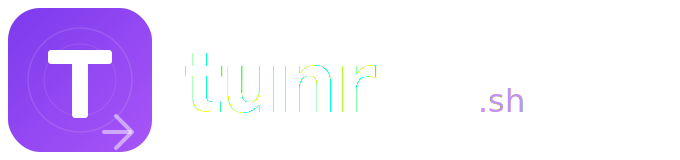

<div align="center">

<br/>

<picture>
  <source media="(prefers-color-scheme: dark)" srcset="assets/logo-wordmark.svg" />
  <source media="(prefers-color-scheme: light)" srcset="assets/logo-wordmark.svg" />
  
</picture>

<br/><br/>

**Local → Public in < 3 seconds.**

[](https://github.com/ahmetvural79/tunr/actions)
[](https://goreportcard.com/report/github.com/ahmetvural79/tunr)
[](https://github.com/ahmetvural79/tunr/releases)
[](LICENSE)
[](go.mod)

[tunr.sh](https://tunr.sh) · [Docs](https://tunr.sh/docs) · [Dashboard](https://app.tunr.sh)

</div>

---

```bash
$ tunr share --port 3000

  🚀 Tunnel active:  https://abc1x2y3.tunr.sh

  Ctrl+C to stop...
```

## What is tunr?

**tunr** exposes your local development server to the internet in under 3 seconds — with automatic HTTPS, WebSocket support, and zero configuration.

It's a developer-first alternative to ngrok and Cloudflare Tunnel, built in Go as a single static binary that runs on macOS, Linux, and Windows (ARM64 included).

### What makes tunr different

| Feature | tunr | ngrok | Cloudflare Tunnel |
|---------|------|-------|-------------------|
| Zero config | ✅ | ⚠️ | ⚠️ |
| Automatic HTTPS | ✅ | ✅ | ✅ |
| WebSocket + HMR | ✅ | ✅ | ✅ |
| **Vibecoder Demo Mode** | ✅ | ❌ | ❌ |
| **Freeze Mode** | ✅ | ❌ | ❌ |
| **Feedback Widget Injection** | ✅ | ❌ | ❌ |
| **Path Routing** | ✅ | ❌ | ⚠️ |
| **Password Protection** | ✅ | ✅ | ✅ (Zero Trust) |
| **Auto-Login Bypass** | ✅ | ❌ | ❌ |
| **Auto-Expiring Tunnels (TTL)** | ✅ | ❌ | ❌ |
| **Request Replay** | ✅ | ❌ | ❌ |
| **Custom Domains** | ✅ | ✅ | ✅ |
| **MCP Integration** | ✅ | ❌ | ❌ |
| HTTP Request Inspector | ✅ | ✅ | ❌ |
| Open Source CLI | ✅ | ❌ | ✅ |
| Single binary | ✅ | ✅ | ⚠️ |

---

## Install

```bash
# macOS (Homebrew) — recommended
brew install ahmetvural79/tap/tunr

# Linux / macOS (one-liner)
curl -sSL https://tunr.sh/install | sh

# npm (Node.js projects)
npx tunr@latest share --port 3000

# Build from source
git clone https://github.com/ahmetvural79/tunr.git
cd tunr
go build -o tunr ./cmd/tunr
```

Requires **Go 1.22+** to build from source.

> **Free forever.** The CLI and all core features are open source. Cloud features (custom subdomains, team dashboards) require a [tunr.sh](https://tunr.sh) account.

---

## Quick Start

```bash
# 1. Start your dev server
npm run dev  # → http://localhost:3000

# 2. Share it
tunr share --port 3000

# That's it. You get:
#   🚀 https://abc1x2y3.tunr.sh
```

---

## Commands

```bash
# Share a local port (foreground)
tunr share --port 3000
tunr share --port 8080 --subdomain myapp  # custom subdomain (Pro)

# Route paths to different ports
tunr share --route /=3000 --route /api=8080

# Password protection & expiration
tunr share -p 8080 --password "secret" --ttl 30m

# Vibecoder demo superpowers
tunr share -p 3000 --demo --freeze --inject-widget
tunr share -p 3000 --auto-login "Cookie: session=demo"

# Custom domain
tunr share -p 3000 --domain demo.client.com

# Machine-readable output for CI/CD
tunr share -p 3000 --json

# Daemon mode (runs in background)
tunr start --port 3000
tunr stop
tunr status

# Inspect & debug
tunr open           # Open HTTP inspector dashboard
tunr logs           # Stream request logs
tunr logs --follow  # Real-time log stream
tunr replay <id>    # Re-send a captured request

# System
tunr doctor         # System health check
tunr version
tunr update         # Self-update to latest release
tunr uninstall      # Remove tunr from your system

# Auth
tunr login
tunr logout

# Config
tunr config show
tunr config init    # Creates .tunr.json in cwd

# AI / MCP
tunr mcp            # Start MCP server (Claude, Cursor, Windsurf)
```

### Full CLI Reference

| Command | Description |
|---------|-------------|
| `tunr share -p PORT` | Expose local port with HTTPS URL |
| `tunr share -p PORT -s NAME` | Custom subdomain (Pro) |
| `tunr share --route /PATH=PORT` | Map specific URL paths to local ports |
| `tunr share -p PORT --password "PASS"` | Enable Basic Authentication |
| `tunr share -p PORT --ttl 1h` | Auto-close tunnel after duration |
| `tunr share -p PORT --demo` | Read-only demo mode |
| `tunr share -p PORT --freeze` | Freeze mode (cache-on-crash) |
| `tunr share -p PORT --inject-widget` | Inject feedback widget into HTML |
| `tunr share -p PORT --auto-login "Cookie: s=demo"` | Auto-inject auth cookie |
| `tunr share -p PORT --domain HOST` | Use custom domain |
| `tunr share -p PORT --json` | JSON output (CI/CD, scripting) |
| `tunr start -p PORT` | Background daemon mode |
| `tunr stop` | Stop daemon |
| `tunr status` | Show active tunnels |
| `tunr logs` | Stream HTTP request logs |
| `tunr open` | Open inspector dashboard |
| `tunr replay <id>` | Replay captured request |
| `tunr doctor` | Diagnose issues |
| `tunr login` | Authenticate (browser-based OAuth) |
| `tunr update` | Self-update CLI binary |
| `tunr uninstall` | Remove tunr from system |
| `tunr mcp` | Start MCP server |
| `tunr config init` | Create `.tunr.json` |

---

## Vibecoder Demo Features

tunr ships with four proxy-level superpowers designed for freelancers and agencies demoing to clients:

### ❄️ Freeze Mode (`--freeze`)

If your local server crashes mid-demo, tunr serves the last successful response from memory. Your client never sees a broken page.

```bash
tunr share --port 3000 --freeze
```

### 🛡️ Read-Only Demo Mode (`--demo`)

Intercept destructive HTTP methods (`POST`, `PUT`, `DELETE`) at the proxy layer. The client can click "Place Order" — nothing actually writes to your database.

```bash
tunr share --port 3000 --demo
```

### 💬 Feedback Widget Injection (`--inject-widget`)

Injects a transparent overlay widget into every HTML page served through the tunnel. Clients can pin visual feedback and errors are forwarded to your terminal in real-time. Like Marker.io, but free and built-in.

```bash
tunr share --port 3000 --inject-widget
```

### 🔑 Auto-Login Bypass (`--auto-login`)

Inject an auth cookie so your client lands on the demo account automatically — no signup, no email verification.

```bash
tunr share --port 3000 --auto-login "Cookie: session=demo-token"
```

Combine them all for the ultimate demo setup:

```bash
tunr share --port 3000 --demo --freeze --inject-widget
```

---

## Advanced Tunnel Features

### 🔒 Password Protected Tunnels (`--password`)

Add Basic Authentication to your public URL instantly without writing any code. Keep your development environments secure from unauthorized access while sharing with clients or third parties.

```bash
tunr share -p 8080 --password "secret"
# Or provide a specific username
tunr share -p 8080 --password "client:secret"
```

### ⏳ Auto-Expiring Tunnels (`--ttl`)

Forget to stop a tunnel exposing your local machine? Use a Time-To-Live (TTL). Once the duration expires, the tunnel daemon safely terminates the connection and shuts down the proxy.

```bash
tunr share -p 3000 --ttl 1h30m
```

### 🔀 Path Routing (`--route`)

Map different incoming URL paths to different upstream ports on your machine. This is perfect for testing microservices or serving your frontend and API from a single public proxy domain.

```bash
# Anything to / goes to 3000, /api goes to 8080
tunr share --route /=3000 --route /api=8080
```

---

## HTTP Inspector

tunr ships with a built-in HTTP request inspector (like ngrok's web UI, but local).

```bash
tunr open  # opens http://localhost:19842
```

Features:
- Live request/response stream
- Headers, body, timing
- One-click replay
- Export as curl command

---

## MCP Integration (Claude, Cursor, Windsurf)

tunr implements the **Model Context Protocol** — AI agents can manage tunnels directly.

**Claude Desktop** (`~/.claude/claude_desktop_config.json`):
```json
{
  "mcpServers": {
    "tunr": {
      "command": "tunr",
      "args": ["mcp"]
    }
  }
}
```

**Cursor** (`.cursor/mcp.json`):
```json
{
  "mcpServers": {
    "tunr": { "command": "tunr", "args": ["mcp"] }
  }
}
```

---

## Configuration (`.tunr.json`)

Create a workspace config file:

```bash
tunr config init
```

```json
{
  "$schema": "https://tunr.sh/schema/.tunr.schema.json",
  "port": 3000,
  "inspectorEnabled": true,
  "dashboardPort": 19842,
  "mcp": { "enabled": true }
}
```

---

## Architecture

tunr is a single Go binary that:

1. Starts a local HTTPS proxy with an embedded inspector
2. Opens a WebSocket connection to the **tunr relay** (edge server)
3. The relay issues a `*.tunr.sh` subdomain and forwards traffic
4. TLS terminates at the relay; local traffic is encrypted end-to-end

```
Browser → relay.tunr.sh → [WebSocket] → tunr binary → localhost:PORT
```

The relay server is proprietary and not part of this repository. You can self-host the CLI against your own relay by overriding the relay URL.

---

## Security

tunr takes security seriously for an open-source CLI tool:

- Auth tokens stored in **OS keychain** (not plaintext files)
- All relay traffic over **TLS 1.3**
- No telemetry, no analytics, no phone-home by default
- Supply chain integrity via `go mod verify` and govulncheck in CI

Found a vulnerability? **Do not open a public issue.** See [SECURITY.md](docs/SECURITY.md).

---

## Contributing

Contributions are welcome! Please read [CONTRIBUTING.md](docs/CONTRIBUTING.md) first.

1. Fork the repository
2. Create a feature branch (`git checkout -b feat/my-feature`)
3. Make your changes
4. Ensure CI passes (`go test ./...` + `golangci-lint run`)
5. Open a pull request

---

## License

PolyForm Shield 1.0.0 — see [LICENSE](LICENSE).

You are free to use, modify, and distribute this software. The only restriction is that you may not use it to build a competing product or service. See the license for full terms.

---

<div align="center">

**[tunr.sh](https://tunr.sh)** · [Docs](https://tunr.sh/docs) · [Discord](https://discord.gg/tunr) · [Twitter/X](https://x.com/vural_met)

Built with 💜 in Go

</div>
